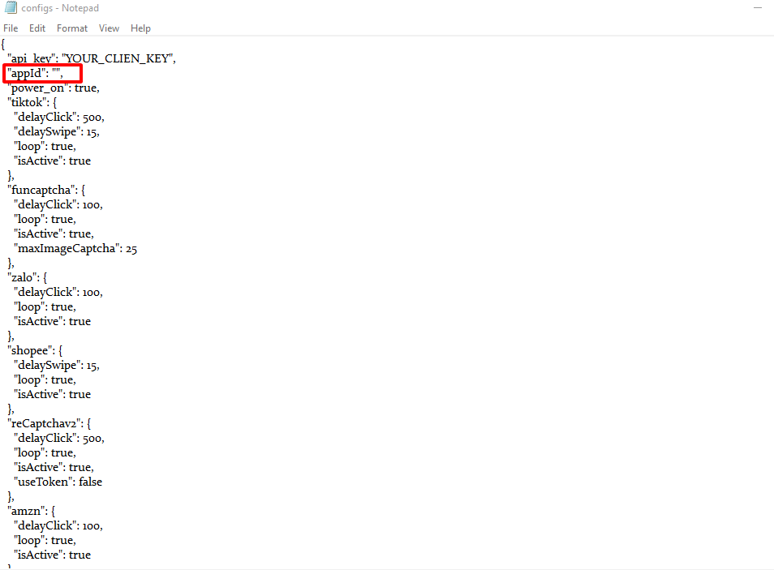
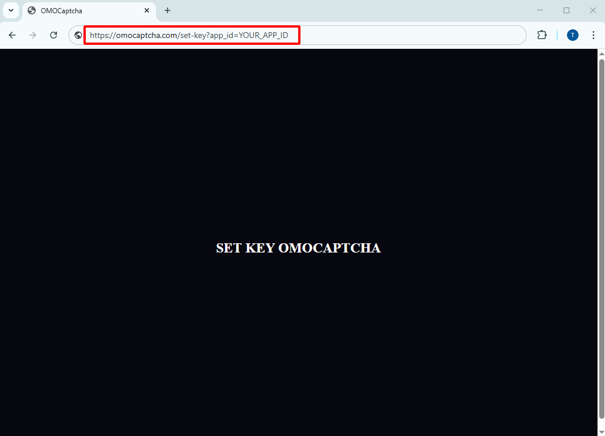

# Sử dụng App Id

## Cách 1. Nhập trực tiếp vào file trong extension

Bấm vào [đây](https://drive.google.com/drive/folders/18XhnFFNIpCBKqIEZo3CFOndMwy_z8Dbm?usp=drive_link) để đến thư mục chữa các extension pass giải nén là 12345

Sau khi tải về và giải nén ta tìm đến file <mark style="color:blue;">`"configs.json"`</mark> trong thư mục extension

<figure><figcaption></figcaption></figure>

Xong ta mở file lên bằng trình soạn thảo văn bản trên máy tính và tìm tới dòng có văn bản <mark style="color:blue;">`"appId"`</mark> mặc định là trống "", bạn thay appId của bạn vào "" thành "YOUR\_APP\_ID" và lưu lại&#x20;

<figure><figcaption></figcaption></figure>

## Cách 2. Nhập qua url trên trình duyệt

Sau khi cài extension vào trình duyệt chỉ cần truy cập url với định dạng như thế này là sẽ tự động set App Id vào extension

URL: [https://omocaptcha.com/set-key?app\_id=YOUR\_APP\_ID](https://omocaptcha.com/set-key?api_key=YOUR_API_KEY)

<figure><figcaption></figcaption></figure>
