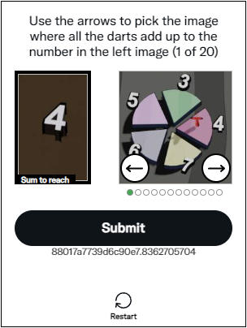
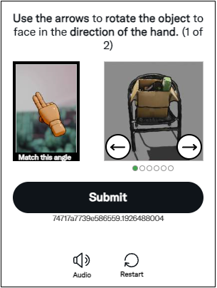
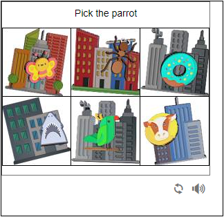
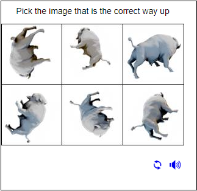

# FunCaptcha Token Hotmail

FunCaptcha Hotmail là một loại hình ảnh xác thực phổ biến trông giống như thế này

<div><figure><figcaption></figcaption></figure> <figure><figcaption></figcaption></figure> <figure><figcaption></figcaption></figure> <figure><figcaption></figcaption></figure></div>

* Extension chrome tự động giải FunCaptcha : [Download](https://drive.google.com/drive/folders/1Yta29aRJAGro4zILxe_hZWoyHhlD2GQg)

## 1.Tạo yêu cầu

### Request

**POST :** `https://omocaptcha.com/api/createJob`

<table><thead><tr><th width="199">Name</th><th width="88">Type</th><th width="112">Required</th><th>Description</th></tr></thead><tbody><tr><td>api_token</td><td>text</td><td>yes</td><td>Khóa tài khoản khách hàng</td></tr><tr><td>data.type_job_id</td><td>text</td><td>yes</td><td>Id dịch vụ captcha cần giải</td></tr></tbody></table>

```json
Host: omocaptcha.com
Content-Type: application/json

{
	"api_token": "YOUR_API_KEY",
	"data": {
		"type_job_id": "47",
	}
}
```

### Phản hồi



```json
{
	"success": false,
	"job_id": 123456,
	"message": "Create job success."
}
```

* Máy chủ sẽ trả về <mark style="color:blue;">`error= false`</mark> và <mark style="color:blue;">`job_id`</mark> thành công



```json
{
	"success": true,
	"message": "MESSAGE_ERROR",
}
```

* Máy chủ sẽ trả về <mark style="color:blue;">`error = true`</mark> và <mark style="color:blue;">`message`</mark> mô tả ngắn về trạng thái



## 2.Nhận kết quả yêu cầu

### Request

**POST :** `https://omocaptcha.com/api/getJobResult`

<table><thead><tr><th width="122">Name</th><th width="99">Type</th><th width="111"> Required</th><th width="412">Description</th></tr></thead><tbody><tr><td>api_token</td><td>text</td><td>yes</td><td>Khóa tài khoản khách hàng</td></tr><tr><td>job_id</td><td>number</td><td>yes</td><td>Id của job vừa tạo</td></tr></tbody></table>

<pre class="language-json"><code class="lang-json"><strong>Host: omocaptcha.com
</strong>Content-Type: application/json

{
	"api_token": "YOU_API_KEY",
	"job_id": 123456
}
</code></pre>

### Phản hồi



```json
{
	"error": false,
	"status": "success",
	"result": "41417c9d63b5d4e25.6591757004|r=ap-southeast-1|meta=3...."
}
```

* Máy chủ sẽ trả về <mark style="color:blue;">`error= false`</mark> và <mark style="color:blue;">`status = success`</mark>
* Đọc kết quả trong <mark style="color:blue;">`result`</mark>
*   ### Cách gửi mã thông báo Hotmail Funcaptcha <a href="#ii.-how-to-submit-funcaptcha-twitter-token" id="ii.-how-to-submit-funcaptcha-twitter-token"></a>

    Đầu tiên, bạn phải tập trung vào iframe có id "arkoseFrame"

    **Với mã Selenium**
*   Chuyển iframe bằng mã C#:

    ```csharp
    driver.SwitchTo().Frame(driver.FindElement(By.Id("arkoseFrame")));
    ```


*   Chuyển iframe bằng mã Python:

    ```csharp
    driver.switch_to.frame(driver.find_element(By.ID, 'arkoseFrame'));
    ```


*   Chuyển iframe bằng mã Java:

    ```java
    WebElement iframe = driver.findElement(By.id("arkoseFrame"));

    //Switch to the frame
    driver.switchTo().frame(iframe);
    ```


*   Gửi mã thông báo:

    ```javascript
    function submit(token) {
        parent.postMessage(JSON.stringify({
            eventId: "challenge-complete",
            payload: { sessionToken: token }
        }), "*");
    }
    submit("token_here");
    ```

    Với _**token\_here**_ là Mã thông báo Funcaptcha bạn nhận được từ dịch vụ OMOcaptcha.com



```json
{
	"error": false,
	"status": "running",
	"result": null
}
```

* <mark style="color:blue;">`error= false`</mark> và <mark style="color:blue;">`status = running`</mark> yêu cầu đang được xử lý, xin vui lòng chờ 2 giây rồi yêu cầu lại



```json
{
	"error": false,
	"status": "fail",
	"result": null
}
```

* Máy chủ sẽ trả về <mark style="color:blue;">`error= false`</mark> và <mark style="color:blue;">`status = fail`</mark>


