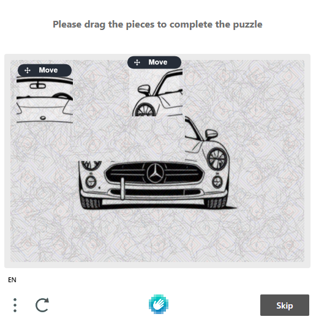
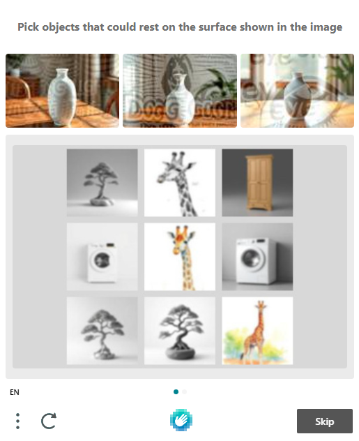
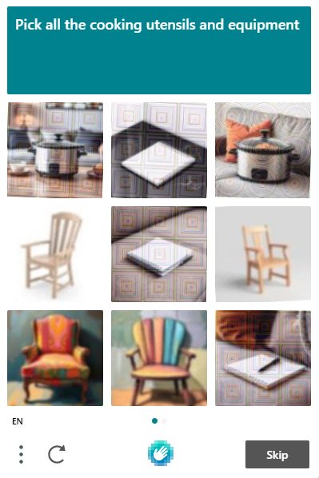
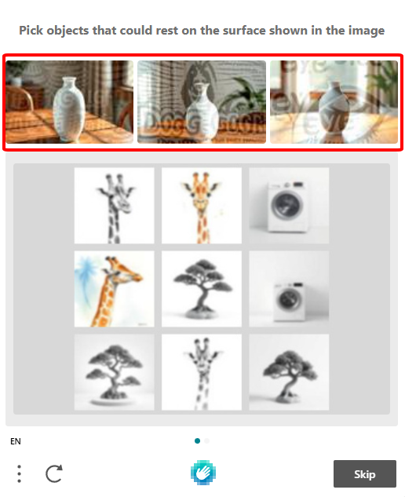
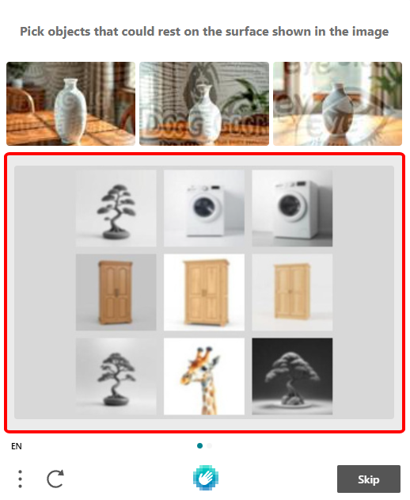
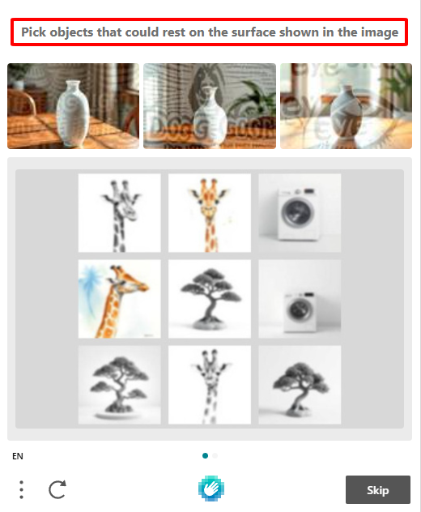

# HcaptchaImageTask

hCaptcha còn được gọi là captcha TÔI KHÔNG PHẢI ROBOT, hCaptcha là một loại hình ảnh xác thực rất phổ biến trông giống thế này:

<div><figure><figcaption></figcaption></figure> <figure><figcaption></figcaption></figure> <figure><figcaption></figcaption></figure></div>

## 1. Tạo yêu cầu

**Request**

<mark style="color:green;">**POST :**</mark> `https://api.omocaptcha.com/v2/createTask`

<table><thead><tr><th width="199">Name</th><th width="99">Type</th><th width="112">Required</th><th>Description</th></tr></thead><tbody><tr><td>clientKey</td><td><mark style="color:blue;"><code>String</code></mark></td><td>yes</td><td>Khóa tài khoản khách hàng</td></tr><tr><td>task.type</td><td><mark style="color:blue;"><code>String</code></mark></td><td>yes</td><td>Tên class dịch vụ captcha cần giải</td></tr><tr><td>task.anchors</td><td><mark style="color:orange;">Array of String</mark></td><td>yes</td><td>Mảng các hình ảnh captcha phần tiêu đề được mã hoá thành base64 (nếu có, không có thì truyền mảng rỗng)</td></tr><tr><td>task.queries</td><td><mark style="color:orange;">Array of String</mark></td><td>yes</td><td>Mảng các hình ảnh captcha được mã hoá thành base64 (nếu là dạng grid thì truyền 9 ảnh theo thứ tự trên DOM, dạng canvas thì truyền 1 ảnh)</td></tr><tr><td>task.question</td><td><mark style="color:blue;"><code>String</code></mark></td><td>yes</td><td>Câu hỏi của thử thách captcha</td></tr><tr><td>task.isScreenshot</td><td><mark style="color:blue;"><code>Bool</code></mark></td><td>no</td><td>Có phải là loại chụp màn hình hay không</td></tr></tbody></table>

```json
{
    "clientKey": "API_KEY",
    "task": {
        "type": "HcaptchaImageTask",
        "anchors": ["base64_image_1", "base64_image_2",...],
        "queries": ["base64_image_1", "base64_image_2",...],
        "question": "Pick all the cooking utensils and equipment"
    }
}
```

Hoặc chỉ cần ảnh chụp màn hình (chứa cả hình captcha và câu hỏi) như sau:

```json
{
    "clientKey": "API_KEY",
    "task": {
        "type": "HcaptchaImageTask",
        "queries": ["base64_image"],
        "isScreenshot": true
    }
}
```


**Response**



```json
{
    "errorId": 0,
    "taskId": "49f9f60a-c809-4af0-93c0-0409b72e67e0"
}
```

* Máy chủ sẽ trả về <mark style="color:blue;">`errorId = 0`</mark> và <mark style="color:blue;">`taskId`</mark> thành công



```json
{
    "errorId": 1,
    "errorCode": "",
    "errorDescription": ""
}
```

* Máy chủ sẽ trả về <mark style="color:blue;">`errorId = 1`</mark> và <mark style="color:blue;">`errorCode`</mark> mã lỗi



## 2a. Nhận kết quả yêu cầu (dạng Grid)

**Request**

<mark style="color:green;">**POST :**</mark> `https://api.omocaptcha.com/v2/getTaskResult`

```json
{
    "clientKey": "API_KEY",
    "taskId": "49f9f60a-c809-4af0-93c0-0409b72e67e0"
}
```

**Response**



```json
{
    "errorId": 0,
    "errorCode": "",
    "errorDescription": "",
    "status": "ready",
    "solution": {
        "objects": [
            1,
            3,
            8
        ]
    }
}
```

* Máy chủ sẽ trả về <mark style="color:blue;">`errorId = 0`</mark> và <mark style="color:blue;">`status = ready`</mark>
* Đọc kết quả trong <mark style="color:blue;">`solution`</mark>



```json
{
    "status": "processing",
    "errorId": 0,
    "errorCode": "",
    "errorDescription": ""
}
```

* Máy chủ sẽ trả về <mark style="color:blue;">`errorId = 0`</mark> và <mark style="color:blue;">`status = processing`</mark> yêu cầu đang được xử lý, xin vui lòng chờ 2 giây rồi yêu cầu lại



```json
{
    "errorId": 1,
    "errorCode": "ERROR_JOB_STATUS",
    "errorDescription": "Job failed",
    "status": "fail",
    "solution": {}
}
```

* Máy chủ sẽ trả về <mark style="color:blue;">`errorId = 1`</mark>



## 2b. Nhận kết quả yêu cầu (dạng click canvas)

**Request**

<mark style="color:green;">**POST :**</mark> `https://api.omocaptcha.com/v2/getTaskResult`

```json
{
    "clientKey": "API_KEY",
    "taskId": "49f9f60a-c809-4af0-93c0-0409b72e67e0"
}
```

**Response**



```json
{
    "errorId": 0,
    "errorCode": "",
    "errorDescription": "",
    "status": "ready",
    "solution": {
        "type": "click",
        "coords": [
            [
                398,
                347
            ]
        ]
    }
}
```

* Máy chủ sẽ trả về <mark style="color:blue;">`errorId = 0`</mark> và <mark style="color:blue;">`status = ready`</mark>
* Đọc kết quả trong <mark style="color:blue;">`solution`</mark>



```json
{
    "status": "processing",
    "errorId": 0,
    "errorCode": "",
    "errorDescription": ""
}
```

* Máy chủ sẽ trả về <mark style="color:blue;">`errorId = 0`</mark> và <mark style="color:blue;">`status = processing`</mark> yêu cầu đang được xử lý, xin vui lòng chờ 2 giây rồi yêu cầu lại



```json
{
    "errorId": 1,
    "errorCode": "ERROR_JOB_STATUS",
    "errorDescription": "Job failed",
    "status": "fail",
    "solution": {}
}
```

* Máy chủ sẽ trả về <mark style="color:blue;">`errorId = 1`</mark>



## 2c. Nhận kết quả yêu cầu (dạng kéo miếng ghép canvas)

**Request**

<mark style="color:green;">**POST :**</mark> `https://api.omocaptcha.com/v2/getTaskResult`

```json
{
    "clientKey": "API_KEY",
    "taskId": "49f9f60a-c809-4af0-93c0-0409b72e67e0"
}
```

**Response**



```json
{
    "errorId": 0,
    "errorCode": "",
    "errorDescription": "",
    "status": "ready",
    "solution": {
        "type": "drag",
        "box": [
            {
                "start": [
                    446,
                    200
                ],
                "end": [
                    100,
                    224
                ]
            },
            {
                "start": [
                    455,
                    300
                ],
                "end": [
                    139,
                    190
                ]
            }
        ]
    }
}
```

* Máy chủ sẽ trả về <mark style="color:blue;">`errorId = 0`</mark> và <mark style="color:blue;">`status = ready`</mark>
* Đọc kết quả trong <mark style="color:blue;">`solution`</mark>



```json
{
    "status": "processing",
    "errorId": 0,
    "errorCode": "",
    "errorDescription": ""
}
```

* Máy chủ sẽ trả về <mark style="color:blue;">`errorId = 0`</mark> và <mark style="color:blue;">`status = processing`</mark> yêu cầu đang được xử lý, xin vui lòng chờ 2 giây rồi yêu cầu lại



```json
{
    "errorId": 1,
    "errorCode": "ERROR_JOB_STATUS",
    "errorDescription": "Job failed",
    "status": "fail",
    "solution": {}
}
```

* Máy chủ sẽ trả về <mark style="color:blue;">`errorId = 1`</mark>


