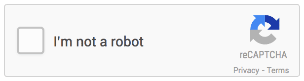

# RecaptchaV2TokenTask

reCAPTCHA-v2 còn được gọi là captcha TÔI KHÔNG PHẢI ROBOT, reCAPTCHA là một loại hình ảnh xác thực rất phổ biến trông giống thế nay:

<figure><figcaption><p>2.Ảnh captcha reCAPTCHA v2</p></figcaption></figure>

Đầu tiên, bạn cần tìm giá trị của tham số <mark style="color:red;">`data-sitekey`</mark> trong mã nguồn của trang web. Mở bảng điều khiển dành cho nhà phát triển trong trình duyệt của bạn và tìm phần tử có thuộc tính <mark style="color:red;">`data-sitekey`</mark>

```html
<div id="recaptcha-demo" class="g-recaptcha" data-sitekey="6Le-wvkSAAAAAPBMRTvw0Q4Muexq9bi0DJwx_mJ-" data-callback="onSuccess" data-action="action">
```

## 1.Tạo yêu cầu

**Request**

<mark style="color:green;">**POST :**</mark> `https://api.omocaptcha.com/v2/createTask`

<table><thead><tr><th width="199">Name</th><th width="99">Type</th><th width="112">Required</th><th>Description</th></tr></thead><tbody><tr><td>clientKey</td><td><mark style="color:blue;"><code>String</code></mark></td><td>yes</td><td>Khóa tài khoản khách hàng</td></tr><tr><td>task.type</td><td><mark style="color:blue;"><code>String</code></mark></td><td>yes</td><td>Tên class dịch vụ captcha cần giải</td></tr><tr><td>task.websiteURL</td><td><mark style="color:blue;"><code>String</code></mark></td><td>yes</td><td>Địa chỉ của một trang web đích. Có thể được đặt ở bất kỳ đâu trên trang web, ngay cả trong khu vực thành viên. Nhân viên của chúng tôi không điều hướng đến đó mà thay vào đó mô phỏng chuyến thăm</td></tr><tr><td>task.websiteKey</td><td><mark style="color:blue;"><code>String</code></mark></td><td>yes</td><td>Khoá trang web Recaptcha. Tìm hiểu cách tìm nó trong bài viết này.</td></tr></tbody></table>

```json
{
    "clientKey": "API_KEY",
    "task": {
        "type": "RecaptchaV2TokenTask",
        "websiteURL": "https://lessons.zennolab.com/captchas/recaptcha/v2_simple.php?level=high",
        "websiteKey": "6Lcg7CMUAAAAANphynKgn9YAgA4tQ2KI_iqRyTwd"
    }
}
```

**Response**



```json
{
    "errorId": 0,
    "taskId": "49f9f60a-c809-4af0-93c0-0409b72e67e0"
}
```

* Máy chủ sẽ trả về <mark style="color:blue;">`errorId = 0`</mark> và <mark style="color:blue;">`taskId`</mark> thành công



```json
{
    "errorId": 1,
    "errorCode": "",
    "errorDescription": ""
}
```

* Máy chủ sẽ trả về <mark style="color:blue;">`errorId = 1`</mark> và <mark style="color:blue;">`errorCode`</mark> mã lỗi



## 2.Nhận kết quả yêu cầu

**Request**

<mark style="color:green;">**POST :**</mark> `https://api.omocaptcha.com/v2/getTaskResult`

```json
{
    "clientKey": "API_KEY",
    "taskId": "49f9f60a-c809-4af0-93c0-0409b72e67e0"
}
```

**Response**



```json
{
    "errorId": 0,
    "status": "ready",
    "solution": {
        "gRecaptchaResponse": "3AHJ_VuvYIBNBW5yyv0zRYJ75VkOKvhKj9_xGBJKnQimF72rfoq3Iy-DyGHMwLAo6a3"
    }
}
```

* Máy chủ sẽ trả về <mark style="color:blue;">`errorId = 0`</mark> và <mark style="color:blue;">`status = ready`</mark>
* Đọc kết quả trong <mark style="color:blue;">`solution`</mark>
* Trong bảng điều khiển dành cho nhà phát triển, tìm <mark style="color:purple;">textarea</mark> với <mark style="color:red;">name="</mark><mark style="color:blue;">g-recaptcha-response</mark><mark style="color:red;">"</mark> và đặt mã nhận được vào đó. Sau đó, nhấp vào nút <mark style="color:blue;">Check</mark>



```json
{
    "status": "processing",
    "errorId": 0,
    "errorCode": "",
    "errorDescription": ""
}
```

* Máy chủ sẽ trả về <mark style="color:blue;">`errorId = 0`</mark> và <mark style="color:blue;">`status = processing`</mark> yêu cầu đang được xử lý, xin vui lòng chờ 2 giây rồi yêu cầu lại



```json
{
    "errorId": 1,
    "errorCode": "ERROR_JOB_STATUS",
    "errorDescription": "Job failed",
    "status": "fail",
    "solution": {}
}
```

* Máy chủ sẽ trả về <mark style="color:blue;">`errorId = 1`</mark>



