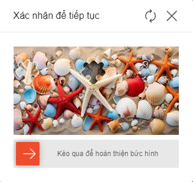
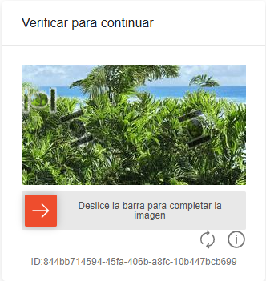
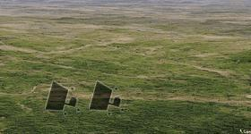

# ShopeeSliderWebTask

Captcha Shopee là một loại hình ảnh xác thực phổ biến trông giống như thế này

<div><figure><figcaption><p>Captcha kéo thả shopee</p></figcaption></figure> <figure><figcaption></figcaption></figure></div>

## 1a. Tạo yêu cầu (Dạng kéo thả thường)

**Request**

<mark style="color:green;">**POST :**</mark> `https://api.omocaptcha.com/v2/createTask`

<table><thead><tr><th width="199">Name</th><th width="141">Type</th><th width="112">Required</th><th>Description</th></tr></thead><tbody><tr><td>clientKey</td><td><mark style="color:blue;"><code>String</code></mark></td><td>yes</td><td>Khóa tài khoản khách hàng</td></tr><tr><td>task.type</td><td><mark style="color:blue;"><code>String</code></mark></td><td>yes</td><td>Tên class dịch vụ captcha cần giải</td></tr><tr><td>task.imageBase64s</td><td><mark style="color:orange;">Array of String</mark></td><td>yes</td><td>Base64 của ảnh miếng ghép và ảnh nền</td></tr></tbody></table>

<table><thead><tr><th width="199">Loại ảnh</th><th>Image</th></tr></thead><tbody><tr><td>Ảnh mask</td><td></td></tr><tr><td>Ảnh background</td><td></td></tr></tbody></table>

```json
{
    "clientKey": "API_KEY",
    "task": {
        "type": "ShopeeSliderWebTask",
        "imageBase64s": ["BASE64_MASK_BODY_HERE", "BASE64_BACKGROUND_BODY_HERE"]
    }
}
```

**Response**



```json
{
    "errorId": 0,
    "taskId": "49f9f60a-c809-4af0-93c0-0409b72e67e0"
}
```

* Máy chủ sẽ trả về <mark style="color:blue;">`errorId = 0`</mark> và <mark style="color:blue;">`taskId`</mark> thành công



## 1b. Tạo yêu cầu (Dạng có quỹ đạo không xác định)

**Request**

<mark style="color:green;">**POST :**</mark> `https://api.omocaptcha.com/v2/createTask`

<table><thead><tr><th width="199">Name</th><th width="141">Type</th><th width="112">Required</th><th>Description</th></tr></thead><tbody><tr><td>clientKey</td><td><mark style="color:blue;"><code>String</code></mark></td><td>yes</td><td>Khóa tài khoản khách hàng</td></tr><tr><td>task.type</td><td><mark style="color:blue;"><code>String</code></mark></td><td>yes</td><td>Tên class dịch vụ captcha cần giải</td></tr><tr><td>task.typeCaptcha</td><td><mark style="color:blue;"><code>String</code></mark></td><td>yes</td><td>Tên loại captcha (ở đây là rotate)</td></tr><tr><td>task.imageBase64s</td><td><mark style="color:orange;">Array of String</mark></td><td>yes</td><td>Base64 của ảnh miếng ghép và ảnh nền</td></tr></tbody></table>

<table><thead><tr><th width="199">Loại ảnh</th><th>Image</th></tr></thead><tbody><tr><td>Ảnh mask</td><td></td></tr><tr><td>Ảnh background</td><td></td></tr></tbody></table>

```json
{
    "clientKey": "API_KEY",
    "task": {
        "type": "ShopeeSliderWebTask",
        "typeCaptcha": "rotate",
        "imageBase64s": ["BASE64_MASK_BODY_HERE", "BASE64_BACKGROUND_BODY_HERE"]
    }
}
```

**Response**



```json
{
    "errorId": 0,
    "taskId": "49f9f60a-c809-4af0-93c0-0409b72e67e0"
}
```

* Máy chủ sẽ trả về <mark style="color:blue;">`errorId = 0`</mark> và <mark style="color:blue;">`taskId`</mark> thành công



```json
{
    "errorId": 1,
    "errorCode": "",
    "errorDescription": ""
}
```

* Máy chủ sẽ trả về <mark style="color:blue;">`errorId = 1`</mark> và <mark style="color:blue;">`errorCode`</mark> mã lỗi



## 2a. Nhận kết quả yêu cầu (Dạng thường)

**Request**

<mark style="color:green;">**POST :**</mark> `https://api.omocaptcha.com/v2/getTaskResult`

```json
{
    "clientKey": "API_KEY",
    "taskId": "49f9f60a-c809-4af0-93c0-0409b72e67e0"
}
```

**Response**



```json
{
    "errorId": 0,
    "status": "ready",
    "solution": {
        "end": {
            "x": 150,
        }
    }
}
```

* Máy chủ sẽ trả về <mark style="color:blue;">`errorId = 0`</mark> và <mark style="color:blue;">`status = ready`</mark>
* Đọc kết quả trong <mark style="color:blue;">`solution`</mark>



## 2b. Nhận kết quả yêu cầu (Dạng có quỹ đạo không xác định)

**Request**

<mark style="color:green;">**POST :**</mark> `https://api.omocaptcha.com/v2/getTaskResult`

```json
{
    "clientKey": "API_KEY",
    "taskId": "49f9f60a-c809-4af0-93c0-0409b72e67e0"
}
```

**Response**



```json
{
    "errorId": 0,
    "status": "ready",
    "solution": {
         "point": {
            "x": 153,
            "y": 78
        }
    }
}
```

* Máy chủ sẽ trả về <mark style="color:blue;">`errorId = 0`</mark> và <mark style="color:blue;">`status = ready`</mark>
* Đọc kết quả trong <mark style="color:blue;">`solution`</mark>



```json
{
    "status": "processing",
    "errorId": 0,
    "errorCode": "",
    "errorDescription": ""
}
```

* Máy chủ sẽ trả về <mark style="color:blue;">`errorId = 0`</mark> và <mark style="color:blue;">`status = processing`</mark> yêu cầu đang được xử lý, xin vui lòng chờ 2 giây rồi yêu cầu lại



```json
{
    "errorId": 1,
    "errorCode": "ERROR_JOB_STATUS",
    "errorDescription": "Job failed",
    "status": "fail",
    "solution": {}
}
```

* Máy chủ sẽ trả về <mark style="color:blue;">`errorId = 1`</mark>


