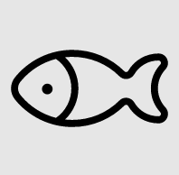

# TencentSelectObjectTask

Captcha select object là một loại hình ảnh xác thực phổ biến trông giống như thế này

<figure><figcaption></figcaption></figure>

## 1. Tạo yêu cầu

**Request**

<mark style="color:green;">**POST :**</mark> `https://api.omocaptcha.com/v2/createTask`

<table><thead><tr><th width="226">Name</th><th width="99">Type</th><th width="112">Required</th><th>Description</th></tr></thead><tbody><tr><td>clientKey</td><td><mark style="color:blue;"><code>String</code></mark></td><td>yes</td><td>Khóa tài khoản khách hàng</td></tr><tr><td>task.type</td><td><mark style="color:blue;"><code>String</code></mark></td><td>yes</td><td>Tên class dịch vụ captcha cần giải</td></tr><tr><td>task.imageBase64</td><td><mark style="color:blue;"><code>String</code></mark></td><td>yes</td><td>Hình ảnh được mã hóa base64<br></td></tr><tr><td>task.question</td><td><mark style="color:blue;"><code>String</code></mark></td><td>yes</td><td>Câu hỏi của captcha</td></tr><tr><td>task.anchor</td><td><mark style="color:blue;"><code>String</code></mark></td><td>yes</td><td>Ảnh anchor (Ngay sau câu hỏi)</td></tr></tbody></table>

```json
{
    "clientKey": "API_KEY",
    "task": {
        "type": "TencentSelectObjectTask",
        "imageBase64": "BASE64_IMAGE_HERE",
        "anchor": "BASE64_ANCHOR_HERE",
        "question": "QUESTION_CAPTCHA"
    }
}
```

**Response**



```json
{
    "errorId": 0,
    "taskId": "49f9f60a-c809-4af0-93c0-0409b72e67e0"
}
```

* Máy chủ sẽ trả về <mark style="color:blue;">`errorId = 0`</mark> và <mark style="color:blue;">`taskId`</mark> thành công



```json
{
    "errorId": 1,
    "errorCode": "",
    "errorDescription": ""
}
```

* Máy chủ sẽ trả về <mark style="color:blue;">`errorId = 1`</mark> và <mark style="color:blue;">`errorCode`</mark> mã lỗi



## 2. Nhận kết quả yêu cầu

**Request**

<mark style="color:green;">**POST :**</mark> `https://api.omocaptcha.com/v2/getTaskResult`

```json
{
    "clientKey": "API_KEY",
    "taskId": "49f9f60a-c809-4af0-93c0-0409b72e67e0"
}
```

**Response**



```json
{
    "errorId": 0,
    "errorCode": "",
    "errorDescription": "",
    "status": "ready",
    "solution": {
        "objects": [
            4,
            5
        ]
    }
}
```

* Máy chủ sẽ trả về <mark style="color:blue;">`errorId = 0`</mark> và <mark style="color:blue;">`status = ready`</mark>
* Đọc kết quả trong <mark style="color:blue;">`solution`</mark>



```json
{
    "status": "processing",
    "errorId": 0,
    "errorCode": "",
    "errorDescription": ""
}
```

* Máy chủ sẽ trả về <mark style="color:blue;">`errorId = 0`</mark> và <mark style="color:blue;">`status = processing`</mark> yêu cầu đang được xử lý, xin vui lòng chờ 2 giây rồi yêu cầu lại



```json
{
    "errorId": 1,
    "errorCode": "ERROR_JOB_STATUS",
    "errorDescription": "Job failed",
    "status": "fail",
    "solution": {}
}
```

* Máy chủ sẽ trả về <mark style="color:blue;">`errorId = 1`</mark>


