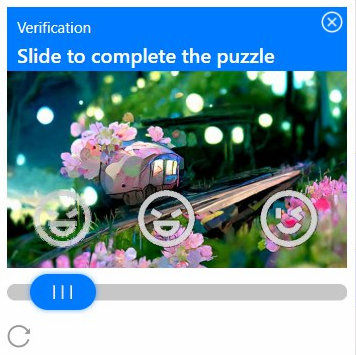

# TencentSlider

Kéo thả trên web là một loại hình ảnh xác thực phổ biến trông giống như thế này

<figure><figcaption></figcaption></figure>

## 1. Tạo yêu cầu

**Request**

<mark style="color:green;">**POST :**</mark> `https://api.omocaptcha.com/v2/createTask`

<table><thead><tr><th width="199">Name</th><th width="99">Type</th><th width="112">Required</th><th>Description</th></tr></thead><tbody><tr><td>clientKey</td><td><mark style="color:blue;"><code>String</code></mark></td><td>yes</td><td>Khóa tài khoản khách hàng</td></tr><tr><td>task.type</td><td><mark style="color:blue;"><code>String</code></mark></td><td>yes</td><td>Tên class dịch vụ captcha cần giải</td></tr><tr><td>task.imageBase64</td><td><mark style="color:blue;"><code>String</code></mark></td><td>yes</td><td>Hình ảnh được mã hóa base64<br></td></tr><tr><td>task.puzzle</td><td><mark style="color:blue;"><code>String</code></mark></td><td>yes</td><td>Hình ảnh được mã hóa base64<br></td></tr><tr><td>task.domain</td><td><mark style="color:blue;"><code>String</code></mark></td><td>yes</td><td>Domain của iframe chứa captcha</td></tr><tr><td>task.widthView</td><td><mark style="color:blue;"><code>Number</code></mark></td><td>yes</td><td>Width thực tế hiển thị của ảnh captcha</td></tr><tr><td>task.heightView</td><td><mark style="color:blue;"><code>Number</code></mark></td><td>yes</td><td>Height thực tế hiển thị của ảnh captcha</td></tr></tbody></table>

```json
{
    "clientKey": "API_KEY",
    "task": {
        "type": "SliderAllWebTask",
        "domain": "global.captcha.gtimg.com",
        "imageBase64": "BACKGROUND_BASE64_IMAGE",
        "puzzle": "PUZZLE_BASE64",
        "widthView": 340,
        "heightView": 243
    }
}
```

**Response**



```json
{
    "errorId": 0,
    "taskId": "49f9f60a-c809-4af0-93c0-0409b72e67e0"
}
```

* Máy chủ sẽ trả về <mark style="color:blue;">`errorId = 0`</mark> và <mark style="color:blue;">`taskId`</mark> thành công



```json
{
    "errorId": 1,
    "errorCode": "",
    "errorDescription": ""
}
```

* Máy chủ sẽ trả về <mark style="color:blue;">`errorId = 1`</mark> và <mark style="color:blue;">`errorCode`</mark> mã lỗi



## 2. Nhận kết quả yêu cầu

**Request**

<mark style="color:green;">**POST :**</mark> `https://api.omocaptcha.com/v2/getTaskResult`

```json
{
    "clientKey": "API_KEY",
    "taskId": "49f9f60a-c809-4af0-93c0-0409b72e67e0"
}
```

**Response**



```json
{
    "errorId": 0,
    "status": "ready",
    "solution": {
         "rects": [
            {
                "x": 183,
                "y": 109,
                "w": 56,
                "h": 70
            }
        ]
    }
}
```

* Máy chủ sẽ trả về <mark style="color:blue;">`errorId = 0`</mark> và <mark style="color:blue;">`status = ready`</mark>
* Đọc kết quả trong <mark style="color:blue;">`solution`</mark>



```json
{
    "status": "processing",
    "errorId": 0,
    "errorCode": "",
    "errorDescription": ""
}
```

* Máy chủ sẽ trả về <mark style="color:blue;">`errorId = 0`</mark> và <mark style="color:blue;">`status = processing`</mark> yêu cầu đang được xử lý, xin vui lòng chờ 2 giây rồi yêu cầu lại



```json
{
    "errorId": 1,
    "errorCode": "ERROR_JOB_STATUS",
    "errorDescription": "Job failed",
    "status": "fail",
    "solution": {}
}
```

* Máy chủ sẽ trả về <mark style="color:blue;">`errorId = 1`</mark>


